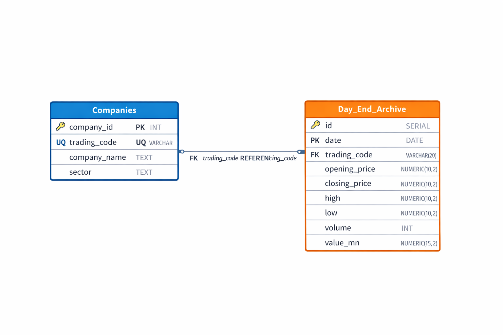

# 📊 DSE Insight: Dhaka Stock Market Analysis using SQL

---

## 📌 Introduction  

The Dhaka Stock Exchange (DSE) plays a crucial role in the financial system of Bangladesh. This project focuses on analyzing stock market data of selected companies for the month of March using SQL.

The purpose of this project is to explore stock price movements, identify growth patterns, analyze trading volume, and understand overall market behavior through structured queries.

---

## 🎯 Objectives  

- Analyze stock price trends across multiple companies  
- Identify top gaining and losing stocks  
- Measure trading volume and activity  
- Understand stock volatility and performance  
- Practice real-world SQL data analysis  

---

## 📂 Dataset Description  

The dataset is collected from the Dhaka Stock Exchange (DSE) Day End Archive.

### 🔹 Key Columns:
- `date` – Trading date  
- `trading_code` – Company ticker symbol  
- `opening_price` – Opening price of the stock  
- `closing_price` – Closing price of the stock  
- `high` – Highest price of the day  
- `low` – Lowest price of the day  
- `volume` – Total shares traded  

---

## 🗄️ Database Schema  

### 📌 Table 1: Companies  

| Column Name   | Description |
|--------------|------------|
| company_id   | Unique company ID (Primary Key) |
| trading_code | Stock ticker symbol (Unique) |
| company_name | Full company name |
| sector       | Industry sector |

---

### 📌 Table 2: Day_End_Archive  

| Column Name              | Description |
|--------------------------|------------|
| id                       | Unique record ID (Primary Key) |
| date                     | Trading date |
| trading_code             | Company ticker (Foreign Key) |
| opening_price            | Opening price |
| closing_price            | Closing price |
| high                     | Highest price |
| low                      | Lowest price |
| volume                   | Number of shares traded |

---

## 🔗 Relationship  

- One company can have multiple daily trading records  
- Tables are linked using `trading_code`  

---

## 📊 Schema Diagram  



---

## 📈 SQL Analysis  

This project contains 13 SQL queries categorized into different levels:

### 🟢 Basic Queries  
- Retrieve all stock data  
- Filter data by company  
- Filter data by specific date  

### 🟡 Intermediate Queries  
- Top traded companies  
- Average stock prices per company  
- Total trading volume per company  

### 🔵 Advanced Queries  
- Top gainers and losers  
- Growth percentage calculation  
- Price volatility analysis  
- Ranking companies by performance  
- First and last day price comparison

### The Analysis

Each query for this project aimed at investigating specific aspects of stock market performance in March 2026. Here’s how I approached each question:

#### 1. Maximum Price Fluctuation (Volatility)

To identify which stocks had the widest price swings, I calculated the growth percentage between the absolute highest and lowest trading prices for each stock. 

```sql
SELECT 
    trading_code,
    MAX(high) AS max_price,
    MIN(low) FILTER (WHERE low > 0) AS min_price,
    ROUND(
        (
            (MAX(high) - MIN(low) FILTER (WHERE low > 0)) 
            / MIN(low) FILTER (WHERE low > 0)
        ) * 100, 
        2
    ) AS growth_percentage
FROM day_end_archive
WHERE trading_code IS NOT NULL
GROUP BY trading_code
ORDER BY growth_percentage DESC;
```
Here's the breakdown of the most volatile stocks:

High Variance: BRACBANK experienced a massive price span, with a 33.85% difference between its peak ($87.00) and its floor ($65.00).

Stagnant Performers: BEXIMCO showed absolutely zero volatility, with its high and low frozen at 110.10.

| Trading Code | Max Price | Min Price | Fluctuation (%) |
| :----------- | --------: | --------: | --------------: |
| BRACBANK     |     87.00 |     65.00 |           33.85 |
| ISLAMIBANK   |     45.00 |     37.10 |           21.29 |
| EBL          |     28.60 |     24.30 |           17.70 |
| BEXIMCO      |    110.10 |    110.10 |            0.00 |


2. True Monthly Growth (March 2026)
Volatility doesn't always equal profit. To find the actual monthly performance, I used Common Table Expressions (CTEs) to isolate the closing prices from March 1st and March 31st to calculate true growth.

```sql
WITH closing_prices AS (
    SELECT trading_code, closing_price AS last_closing_price
    FROM day_end_archive
    WHERE closing_price IS NOT NULL AND date = '2026-03-31'
),
first_closing_prices AS (
    SELECT trading_code, closing_price AS first_closing_price
    FROM day_end_archive
    WHERE closing_price IS NOT NULL AND date = '2026-03-01'
)
SELECT
    cp.trading_code,
    cp.last_closing_price,
    fcp.first_closing_price,
    ROUND(((cp.last_closing_price - fcp.first_closing_price) / fcp.first_closing_price) * 100, 2) AS growth_percentage
FROM closing_prices cp
INNER JOIN first_closing_prices fcp ON cp.trading_code = fcp.trading_code
ORDER BY growth_percentage DESC;
```
Here's the breakdown of true monthly growth:

Across-the-Board Losses: Every single stock analyzed (excluding BEXIMCO, which remained flat at 0.00%) experienced negative growth in March.

The Volatility Trap: Despite having the highest price fluctuations (noted in Query 1), BRACBANK suffered the steepest actual drop, losing 20.24% of its value from the start to the end of the month.
| Trading Code | March 1st Close | March 31st Close | True Growth (%) |
| :----------- | --------------: | ---------------: | --------------: |
| BEXIMCO      |          110.10 |           110.10 |            0.00 |
| SINGERBD     |           87.30 |            86.00 |           -1.49 |
| ISLAMIBANK   |           43.80 |            38.80 |          -11.42 |
| BRACBANK     |           84.00 |            67.00 |          -20.24 |


3. Overall Market Price Trend
To validate the bearish trend seen in individual stocks, I calculated the daily average closing price across the entire recorded market to see the macro trend.

```SQL
SELECT
    date,
    ROUND(AVG(closing_price), 2) AS average_closing_price
FROM day_end_archive
WHERE closing_price IS NOT NULL
GROUP BY date
ORDER BY date;
```
Here's a breakdown of the market trend:

Steady Decline: The market opened the month with a strong average of 248.87 on March 1st but bled consistently throughout the weeks, closing the month at a low of 238.65.

Lack of Recovery: There were no significant market-wide rallies during the month, confirming a sustained bearish environment.

| Date       | Average Closing Price |
| :--------- | --------------------: |
| 2026-03-01 |                248.87 |
| 2026-03-15 |                243.57 |
| 2026-03-31 |                238.65 |


4. Daily Trading Volume Leaders
Finally, I wanted to know which stocks were moving the most shares. I used a subquery to find the exact stock that dominated the trading volume for each specific date.

```sql
SELECT
    date,
    trading_code,
    volume AS highest_traded_volume
FROM day_end_archive
WHERE volume IS NOT NULL
AND volume = (
                SELECT MAX(volume) 
                FROM day_end_archive AS sub
                WHERE sub.date = day_end_archive.date )
ORDER BY date, highest_traded_volume DESC;
```
Here's the breakdown of the volume leaders:

ROBI's Dominance: The telecom sector, specifically ROBI, was the undisputed king of volume, holding the highest traded volume for 14 out of the 17 recorded trading days.

Late-Month Shift: BRACBANK saw massive volume spikes towards the end of the month (March 16, 25, and 31), likely correlating with investors reacting to its steep 20% drop in value.

| Date       | Top Traded Stock |     Volume |
| :--------- | :--------------- | ---------: |
| 2026-03-03 | ROBI             | 10,206,706 |
| 2026-03-15 | ROBI             |  6,025,692 |
| 2026-03-16 | BRACBANK         |  1,753,108 |
| 2026-03-31 | BRACBANK         |  3,871,365 |


---

## 📁 Project Structure  
DSE-Insight-Project/
│
├── data/
│ └── stock_data.csv
│
├── sql/
│ ├── query_1.sql
│ ├── query_2.sql
│ ├── ...
│
├── images/
│ ├── schema.png
│ ├── chart.png
│
└── README.md

---

## 📊 Visualization  

The following visualizations can be added to better understand the data:

- 📈 Stock price trends  
- 📊 Trading volume comparison  
- 🏆 Top performing companies  

).png](<Attachment/10_Find top gainers (growth(Volatility)).png>))

---

## 🔍 Key Insights  

- Some companies experienced steady growth throughout the month  
- High trading volume indicates strong investor interest  
- Certain stocks showed high volatility, indicating higher risk  
- Telecom and pharmaceutical sectors demonstrated relatively stable performance  

---

## 🚀 Tools Used  

- PostgreSQL  
- Microsoft Excel  
- GitHub  

---

## 🧠 Learning Outcomes  

- Designed relational database structure  
- Implemented real-world SQL queries  
- Learned stock market analysis techniques  
- Improved data cleaning and transformation skills  
- Gained experience in data-driven decision making  

---

## 📌 Conclusion  

This project demonstrates how SQL can be effectively used to analyze stock market data and extract meaningful insights. By examining price trends, trading volume, and company performance, we can better understand market behavior and investment opportunities.

The project highlights the importance of structured data, proper database design, and analytical thinking in solving real-world financial problems.

---
